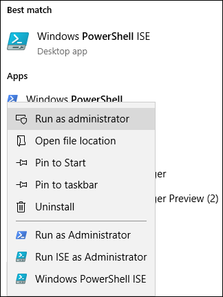
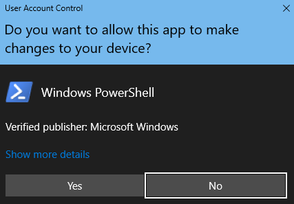

# <a name="fasttrack-migration-toolset-for-submitting-delete-request"></a><span data-ttu-id="b642b-104">FastTrack-Migrationstoolset zum Übermitteln von Löschanforderungen</span><span class="sxs-lookup"><span data-stu-id="b642b-104">FastTrack Migration Toolset for Submitting Delete Request</span></span>

## <a name="toolset-purpose"></a><span data-ttu-id="b642b-105">Zweck des Toolsets</span><span class="sxs-lookup"><span data-stu-id="b642b-105">Toolset purpose</span></span>

<span data-ttu-id="b642b-p101">Für den Fall, dass Sie als Kunde derzeit an FastTrack-Migrationen beteiligt sind, wird durch das Löschen des Benutzerkontos nicht die Datenkopie im Besitz des Microsoft FastTrack-Teams gelöscht, die ausschließlich für das Abschließen der Migration beibehalten wird. Wenn Sie möchten dass das Microsoft FastTrack-Team während der Migration auch die Datenkopie löscht, übermitteln Sie eine diesbezügliche Anforderung über dieses Toolset. Im normalen Geschäftsverlauf löscht Microsoft FastTrack alle Datenkopien, sobald die Migration abgeschlossen ist.</span><span class="sxs-lookup"><span data-stu-id="b642b-p101">In the event that you are a customer currently engaged in FastTrack migrations, deleting the user account will not delete the data copy held by the Microsoft FastTrack team, which is held for the sole purpose of completing the migration. If during the migration you would like the Microsoft FastTrack team to also delete the data copy, submit a request via this tool set. In the ordinary course of business, Microsoft FastTrack will delete all data copies once the migration is complete.</span></span>

### <a name="supported-platforms"></a><span data-ttu-id="b642b-109">Unterstützte Plattformen</span><span class="sxs-lookup"><span data-stu-id="b642b-109">Supported platforms</span></span>

<span data-ttu-id="b642b-p102">Microsoft unterstützt die erste Version dieses Toolsets auf der Windows-Plattform und der PowerShell-Konsole. Die folgenden bekannten Plattformen werden von diesem Toolset unterstützt:</span><span class="sxs-lookup"><span data-stu-id="b642b-p102">Microsoft supports the initial release of this  toolset in the Windows platform and PowerShell console. The following known platforms are supported by this toolset:</span></span>

<span data-ttu-id="b642b-112">\***Tabelle 1 – Von diesem Toolset unterstützte Plattformen** _</span><span class="sxs-lookup"><span data-stu-id="b642b-112">\***Table 1 — Platforms supported by this toolset** _</span></span>

<span data-ttu-id="b642b-113">_\*\*\*</span><span class="sxs-lookup"><span data-stu-id="b642b-113">_\*\*\*</span></span>

|<span data-ttu-id="b642b-114">PowerShell-Version</span><span class="sxs-lookup"><span data-stu-id="b642b-114">PowerShell version</span></span>|<span data-ttu-id="b642b-115">Windows 7</span><span class="sxs-lookup"><span data-stu-id="b642b-115">Windows 7</span></span>|<span data-ttu-id="b642b-116">Windows 8</span><span class="sxs-lookup"><span data-stu-id="b642b-116">Windows 8</span></span>|<span data-ttu-id="b642b-117">Windows 10</span><span class="sxs-lookup"><span data-stu-id="b642b-117">Windows 10</span></span>|<span data-ttu-id="b642b-118">Windows Server 2012</span><span class="sxs-lookup"><span data-stu-id="b642b-118">Windows Server 2012</span></span>|<span data-ttu-id="b642b-119">Windows Server 2016</span><span class="sxs-lookup"><span data-stu-id="b642b-119">Windows Server 2016</span></span>|
|:---:|:---:|:---:|:---:|:---:|:---:|
|<span data-ttu-id="b642b-120">5.0</span><span class="sxs-lookup"><span data-stu-id="b642b-120">5.0</span></span>|<span data-ttu-id="b642b-121">Nicht unterstützt</span><span class="sxs-lookup"><span data-stu-id="b642b-121">Not Supported</span></span>|<span data-ttu-id="b642b-122">Unterstützt</span><span class="sxs-lookup"><span data-stu-id="b642b-122">Supported</span></span>|<span data-ttu-id="b642b-123">Unterstützt</span><span class="sxs-lookup"><span data-stu-id="b642b-123">Supported</span></span>|<span data-ttu-id="b642b-124">Unterstützt</span><span class="sxs-lookup"><span data-stu-id="b642b-124">Supported</span></span>|<span data-ttu-id="b642b-125">Unterstützt</span><span class="sxs-lookup"><span data-stu-id="b642b-125">Supported</span></span>|
|<span data-ttu-id="b642b-126">5.1</span><span class="sxs-lookup"><span data-stu-id="b642b-126">5.1</span></span>|<span data-ttu-id="b642b-127">Nicht unterstützt</span><span class="sxs-lookup"><span data-stu-id="b642b-127">Not Supported</span></span>|<span data-ttu-id="b642b-128">Unterstützt</span><span class="sxs-lookup"><span data-stu-id="b642b-128">Supported</span></span>|<span data-ttu-id="b642b-129">Unterstützt</span><span class="sxs-lookup"><span data-stu-id="b642b-129">Supported</span></span>|<span data-ttu-id="b642b-130">Unterstützt</span><span class="sxs-lookup"><span data-stu-id="b642b-130">Supported</span></span>|<span data-ttu-id="b642b-131">Unterstützt</span><span class="sxs-lookup"><span data-stu-id="b642b-131">Supported</span></span>|
|

### <a name="obtaining-the-toolset"></a><span data-ttu-id="b642b-132">Abrufen des Toolsets</span><span class="sxs-lookup"><span data-stu-id="b642b-132">Obtaining the toolset</span></span>

<span data-ttu-id="b642b-p103">Dieses Toolset ist im PowerShell-Katalog in der PowerShell-Konsolenanwendung verfügbar. Zum Suchen und Laden dieses Cmdlet-Moduls öffnen Sie zunächst PowerShell im Administratormodus, damit die erforderlichen Berechtigungen zum Installieren des Moduls vorhanden sind. Wenn Sie PowerShell zum ersten Mal verwenden, geben Sie auf der Windows-Taskleiste im Suchfeld „PowerShell“ ein. Wählen Sie die Konsole mit einem Rechtsklick aus, wählen Sie **als Administrator ausführen**, und klicken Sie dann auf **Ja**, um Windows PowerShell auszuführen.</span><span class="sxs-lookup"><span data-stu-id="b642b-p103">This toolset is available in the PowerShell Gallery on the PowerShell console application.  To locate and load this cmdlet module, first open PowerShell in administrator mode so it has the appropriate permissions to install the module. If you have not used PowerShell previously go to your Windows Task Bar and in the search box type 'PowerShell”. Select the console app using right-click and choose **Run as administrator**, then click **Yes** to run Windows PowerShell.</span></span>





<span data-ttu-id="b642b-p104">Nachdem die Konsole geöffnet wurde, müssen Sie Berechtigungen für die Skriptausführung festlegen. Geben Sie den folgenden Befehl ein, um die Ausführung der Skripts zuzulassen:</span><span class="sxs-lookup"><span data-stu-id="b642b-p104">Now that the console is open, you need to set permissions for script execution. Type the following command to allow the scripts to run:</span></span>

```powershell
Set-ExecutionPolicy -ExecutionPolicy Bypass -Scope Process
```

<span data-ttu-id="b642b-141">Sie werden aufgefordert, diese Aktion zu bestätigen, da der Administrator den Bereich nach eigenem Ermessen ändern kann.</span><span class="sxs-lookup"><span data-stu-id="b642b-141">You will be prompted to confirm this action, as the administrator can change the scope at their discretion.</span></span>

<span data-ttu-id="b642b-142">\**_Festlegen der Ausführungsrichtlinie_* _</span><span class="sxs-lookup"><span data-stu-id="b642b-142">\**_Set Execution Policy_* _</span></span>


<span data-ttu-id="b642b-144">Da die Konsole nun so eingerichtet ist, dass die Skriptausführung zulässig ist, führen Sie den folgenden Befehl aus, um das Modul zu installieren:</span><span class="sxs-lookup"><span data-stu-id="b642b-144">Now that the console is set to allow the script, run this next command to install the module:</span></span>

```powershell
Install-Module -Name Microsoft.FastTrack -Repository PSGallery -WarningAction SilentlyContinue -Force
```

### <a name="prerequisites-for-module"></a><span data-ttu-id="b642b-145">Voraussetzungen für Modul</span><span class="sxs-lookup"><span data-stu-id="b642b-145">Prerequisites for module</span></span>

<span data-ttu-id="b642b-p105">Zur erfolgreichen Ausführung dieses Moduls müssen Sie u.U. abhängige Module für die Verwendung installieren, falls diese nicht bereits installiert sind. Möglicherweise müssen Sie PowerShell neu starten.</span><span class="sxs-lookup"><span data-stu-id="b642b-p105">To successfully execute this module, you may need to install dependent modules for use if they are not already installed. You may need to restart PowerShell.</span></span>

<span data-ttu-id="b642b-p106">Zum Übermitteln einer Datensubjektanforderung müssen Sie sich zuerst mithilfe Ihrer Anmeldeinformationen für Office 365 anmelden. Durch Eingabe der richtigen Anmeldeinformationen wird Ihr Status als globaler Administrator überprüft, und Mandanteninformationen werden erfasst.</span><span class="sxs-lookup"><span data-stu-id="b642b-p106">In order to submit a DSR, you must first log in using your Office 365 credentials. Entering the proper credentials will validate your global administrator status and collect tenant information.</span></span>

```powershell
Login-FastTrackAccount -ApiKey <API Key provided by FastTrack MVM>
```

<span data-ttu-id="b642b-150">Nach der erfolgreichen Anmeldung werden die Anmeldeinformationen und der Schlüssel zur Verwendung mit FastTrack-Modulen für den Rest der aktuellen PowerShell-Sitzung gespeichert.</span><span class="sxs-lookup"><span data-stu-id="b642b-150">Once successfully logged in, the credentials and key will be stored for use with FastTrack modules for the remainder of the current PowerShell session.</span></span>

<span data-ttu-id="b642b-151">Wenn Sie eine Verbindung mit einer Cloudumgebung für andere als kommerzielle Zwecke herstellen müssen, muss dem *Login*-Befehl _-Environment\* mit einer der folgenden gültigen Umgebungen hinzugefügt werden:</span><span class="sxs-lookup"><span data-stu-id="b642b-151">If you need to connect to a cloud environment, other than commercial, _-Environment\* will need to be added to *Log in* command with one of the following valid environments:</span></span>

- <span data-ttu-id="b642b-152">AzureCloud</span><span class="sxs-lookup"><span data-stu-id="b642b-152">AzureCloud</span></span>
- <span data-ttu-id="b642b-153">AzureChinaCloud</span><span class="sxs-lookup"><span data-stu-id="b642b-153">AzureChinaCloud</span></span>
- <span data-ttu-id="b642b-154">AzureGermanCloud</span><span class="sxs-lookup"><span data-stu-id="b642b-154">AzureGermanCloud</span></span>
- <span data-ttu-id="b642b-155">AzureUSGovernmentCloud</span><span class="sxs-lookup"><span data-stu-id="b642b-155">AzureUSGovernmentCloud</span></span>

```powershell
Login-FastTrackAccount -ApiKey <API Key provided by FastTrack MVM> -Environment <cloud environment>
```

<span data-ttu-id="b642b-156">Führen Sie den folgenden Befehl aus, um eine DSR-Anforderung einzureichen:</span><span class="sxs-lookup"><span data-stu-id="b642b-156">To submit a DSR request, run the following command:</span></span>

```powershell
Submit-FastTrackGdprDsrRequest -DsrRequestUserEmail SubjectUserEmail@mycompany.com
```

<span data-ttu-id="b642b-p107">Bei Erfolg gibt das Cmdlet ein Transaktions-ID-Objekt zurück. Bewahren Sie die Transaktions-ID auf.</span><span class="sxs-lookup"><span data-stu-id="b642b-p107">On success, the cmdlet will return a Transaction ID object. Please retain the Transaction ID.</span></span>

#### <a name="checking-the-status-of-a-request-transaction"></a><span data-ttu-id="b642b-159">Überprüfen des Status einer Anforderungstransaktion</span><span class="sxs-lookup"><span data-stu-id="b642b-159">Checking the status of a request transaction</span></span>

<span data-ttu-id="b642b-160">Führen Sie die folgende Funktion mit der zuvor abgerufenen Transaktions-ID aus:</span><span class="sxs-lookup"><span data-stu-id="b642b-160">Run the following function using the previously obtained Transaction ID:</span></span>

```powershell
Get-FastTrackGdprDsrRequest -TransactionID "YourTransactionID"
```

#### <a name="transaction-status-codes"></a><span data-ttu-id="b642b-161">Transaktionstatuscodes</span><span class="sxs-lookup"><span data-stu-id="b642b-161">Transaction Status Codes</span></span>

|<span data-ttu-id="b642b-162">Transaction</span><span class="sxs-lookup"><span data-stu-id="b642b-162">Transaction</span></span>|<span data-ttu-id="b642b-163">Status</span><span class="sxs-lookup"><span data-stu-id="b642b-163">Status</span></span>|
|---|---|
|<span data-ttu-id="b642b-164">**Erstellt**</span><span class="sxs-lookup"><span data-stu-id="b642b-164">**Created**</span></span>|<span data-ttu-id="b642b-165">Die Anforderung wurde erstellt.</span><span class="sxs-lookup"><span data-stu-id="b642b-165">Request has been created.</span></span>|
|<span data-ttu-id="b642b-166">**Fehlgeschlagen**</span><span class="sxs-lookup"><span data-stu-id="b642b-166">**Failed**</span></span>|<span data-ttu-id="b642b-167">Fehler beim Erstellen der Anforderung. Übermitteln Sie sie erneut, oder wenden Sie sich an den Support.</span><span class="sxs-lookup"><span data-stu-id="b642b-167">Request failed to create, please resubmit, or contact support.</span></span>|
|<span data-ttu-id="b642b-168">**Abgeschlossen**</span><span class="sxs-lookup"><span data-stu-id="b642b-168">**Completed**</span></span>|<span data-ttu-id="b642b-169">Die Anforderung wurde abgeschlossen und bereinigt.</span><span class="sxs-lookup"><span data-stu-id="b642b-169">Request has been completed and sanitized.</span></span>|
|

<!-- original version: **Created**  Request has been created<br/>**Failed** Request failed to create, please resubmit, or contact support<br/>**Completed** Request has been completed and sanitized -->

## <a name="learn-more"></a><span data-ttu-id="b642b-170">Weitere Informationen</span><span class="sxs-lookup"><span data-stu-id="b642b-170">Learn more</span></span>

[<span data-ttu-id="b642b-171">Microsoft Trust Center</span><span class="sxs-lookup"><span data-stu-id="b642b-171">Microsoft Trust Center</span></span>](https://www.microsoft.com/trust-center/privacy/gdpr-overview)
